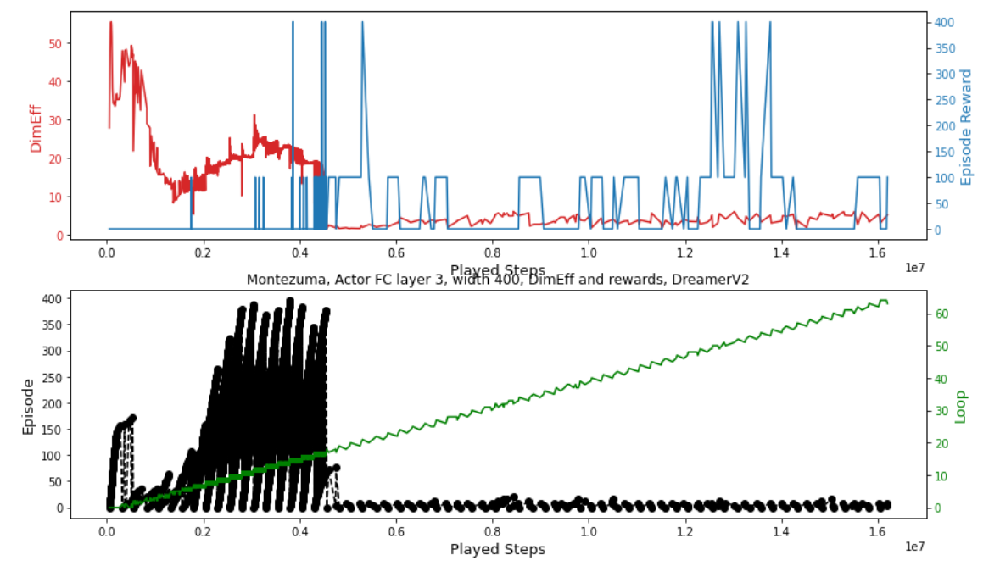

# Effective Dimension in Atari Reinforcement Learning

DreamerV2 from https://github.com/danijar/dreamerv2 atapted to measure effective dimension in Actor network as defined in https://arxiv.org/abs/2006.04791

DimEff is computed from activations in notebooks and implemented as @tf.function layer regularizer in common/nets.py

The effect of Actor MLP regularization may lead to faster training, results are however not very strong.

